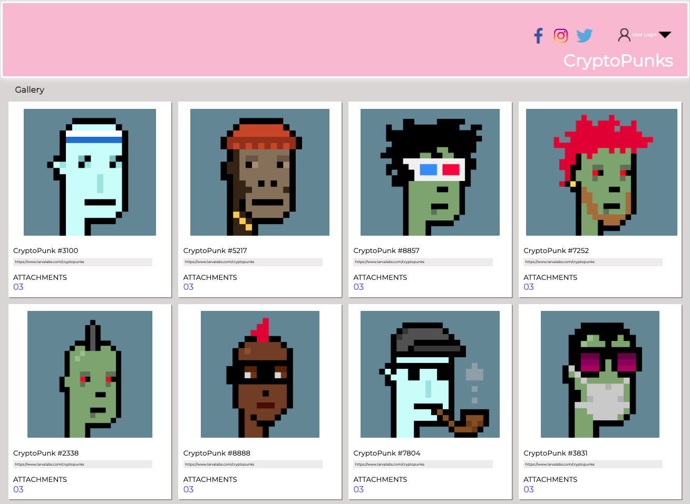

# Static-Comp-Challenge

## Abstract
This static comp challenge was assigned so that developers can fine tune their CSS and HTML skills and attempt to recreate a webpage based off of a provided static comp.  

## Provided Static Comp

## Final Version

## Instructions to Access Application

2. On your Terminal: `git clone git@github.com:aburg15/Static-Comp-Challenge.git`
3. `cd`into the repository (directory)
4. Run the command `open index.html`

## Technologies
- HTML
- CSS grid and CSS flexbox

## Rubric (includes comp to be matched)
[Static Comp](https://frontend.turing.edu/projects/static-comp-challenge.html)